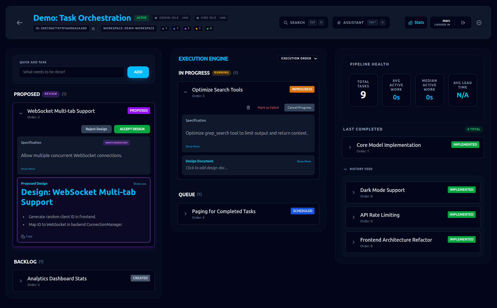

# Ajapopaja Build

[](https://github.com/marcbaechinger/ajapopaja-build/actions/workflows/ci.yml)
[](https://opensource.org/licenses/Apache-2.0)
[](https://github.com/marcbaechinger/ajapopaja-build/releases)

Welcome to **Ajapopaja Build**, the advanced, automated task pipeline manager designed for Coding AI Agents (like Gemini CLI or Claude).

---

## 1. Project Overview

The project is structured as a monorepo with a Python backend and a TypeScript/Vite frontend:

- **`backend/`**: A `uv` workspace containing:
  - `core`: Shared Beanie/Pydantic models and database logic.
  - `api`: FastAPI management server.
  - `ajapopaja_mcp`: MCP server for AI agent interactions.
- **`frontend/`**: A Vite-based Single Page Application (SPA) with Tailwind CSS v4.
- **`design/`**: Architectural and project setup documentation.

---

## 2. Architecture

Ajapopaja Build follows a decoupled, message-driven architecture to facilitate autonomous agent interaction with a human-supervised management layer.

### High-Level Flow

1. **Task Creation**: Users or systems create tasks in a Pipeline.
2. **Scheduling**: Tasks are prioritized and moved to the `scheduled` state.
3. **Agent Interaction (MCP)**: An AI agent connects via the Model Context Protocol (MCP) server. It fetches the next task, optionally submits a design doc, and implements the change.
4. **Human Review**: If a design doc is submitted, the task enters a `PROPOSED` state. A human reviews it in the SPA and either accepts (scheduling it for implementation) or rejects it.
5. **Implementation & Validation**: The agent implements the approved design, runs tests, and marks the task as `implemented` with a commit hash.

---

## 3. Developer Environment Setup

### Prerequisites

- **Python 3.11+**
- **Node.js 18+**
- **uv**: Modern Python package manager.
- **MongoDB**: A running instance (local or Atlas).

### Installation

1. **Clone the repository:**

   ```bash
   git clone <repo-url>
   cd ajapopaja-build
   ```

2. **Initialize Backend (Python/uv):**

   ```bash
   cd backend
   uv sync
   ```

3. **Initialize Frontend (Node/npm):**

   ```bash
   cd frontend
   npm install
   ```

---

## 4. Running the System

### Configuration

Set the following environment variables (or use a `.env` file in the root):

- `MONGODB_URI`: Connection string (default: `mongodb://localhost:27017`)
- `DATABASE_NAME`: Database name (default: `ajapopaja_build`)
- `WORKSPACES_ROOT`: Root directory for all pipeline workspaces (default: `/home/marc-baechinger/monolit/code`). All `workspace_path` values in pipelines are relative to this root.

### Execution Commands

Run these commands from the project root. To stop a server, use `Ctrl+C`.

| Component | Command | URL/Access |
| :--- | :--- | :--- |
| **FastAPI Server** | `cd backend && uv run --package api uvicorn api.main:app --reload` | [http://localhost:8000](http://localhost:8000) |
| **API Docs (Swagger)** | (Run FastAPI first) | [http://localhost:8000/docs](http://localhost:8000/docs) |
| **MCP Server** | Integrated in API (or run separately for local dev) | [http://localhost:8000/mcp/sse](http://localhost:8000/mcp/sse) |
| SPA Frontend | `cd frontend && npm run dev` | [http://localhost:5173](http://localhost:5173) |

---

## 5. Usage & Workflow Guide

Once the system is running, follow this end-to-end workflow to start managing autonomous agent tasks.

### 5.1. Configure Gemini CLI

To allow Gemini CLI (or any MCP-compatible agent) to communicate with Ajapopaja Build, add the local MCP server to your configuration:

```json
{
  "mcpServers": {
    "ajapopaja": {
      "url": "http://localhost:8000/mcp/sse"
    }
  }
}
```

### 5.2. The Management Workflow



1. **Access the Dashboard**: Open [http://localhost:5173](http://localhost:5173) in your browser.
2. **Create a Pipeline**: Click "New Pipeline". Provide a name and a local workspace path (relative to your `WORKSPACES_ROOT`).
3. **Define a Task**: Within the pipeline, create a new task.
    - **Spec**: Provide a clear, technical description of what needs to be done.
    - **Design Review**: Enable "Want Design Doc" if you want to approve the agent's plan before it starts coding.
4. **Prioritize & Schedule**: Set the task order and click "Schedule". The task is now ready for an agent to pick up.

### 5.3. Agent Execution

Invoke Gemini CLI and direct it to your pipeline using its ID (found in the browser URL). Use a prompt like:

> "Check for the next task using the **ajapopaja** mcp server for pipeline **[PIPELINE_ID]**. Implement the task, including tests, and continue until no more tasks are scheduled."

### 5.4. Human-in-the-Loop Review

If you requested a design document:

1. The agent will submit a plan and move the task to the **Proposed** state.
2. Review the Markdown design document in the SPA dashboard.
3. Click **Accept** to authorize implementation, or **Reject** to send it back for revisions.
4. Once accepted, the agent will automatically pick up the implementation on its next check.

---

## 6. Docker Build & Deployment

You can build a production-ready Docker image that contains both the backend and the frontend.

### Build the Image

Use the provided build script to compile the frontend and package the backend:

```bash
./docker-build.sh 0.1.0
```

### First-time Setup: Create Admin User

After building the image, you need to create the initial user in your database:

```bash
docker run --rm \
  --add-host=host.docker.internal:host-gateway \
  -e MONGODB_URI=mongodb://host.docker.internal:27017/ \
  ajapopaja-build:0.1.0 \
  uv run --package api python api/src/api/seed_user.py
```

This creates a user with username `admin` and password `admin`.

### Local Deployment as System Service

A deployment script is provided to build the image, save it to `/data/ajapopaja/docker`, and install it as a Linux system service.

1. **Run the deployment script:**

    ```bash
    ./deploy-local.sh
    ```

2. **Manage the service:**

    ```bash
    sudo systemctl start ajapopaja-build
    sudo systemctl stop ajapopaja-build
    sudo systemctl status ajapopaja-build
    ```

3. **Configure environment:**
    Edit `/etc/ajapopaja-build.env` to change the port or database URI, then restart the service.

### Run the Container Manually

If you have MongoDB running on your host system, use the following command:

```bash
docker run -p 8000:8000 \
  -v /home:/home \
  -v /Users:/Users \
  -v /tmp/nvimsocket:/tmp/nvimsocket \
  --add-host=host.docker.internal:host-gateway \
  -e MONGODB_URI=mongodb://host.docker.internal:27017/ \
  -e PORT=8000 \
  -e WORKSPACES_ROOT=/home/marc-baechinger/monolit/code \
  ajapopaja-build:0.1.0
```

The application will be accessible at [http://localhost:8000](http://localhost:8000).

---

## 7. Testing & Quality Assurance

### Python Backend

Run all backend tests from the `backend/` directory:

```bash
cd backend
uv run pytest
```

**Watch Mode** (Runs tests on file change):

```bash
cd backend
uv run ptw
```

### Frontend SPA

Run frontend tests or linting from the `frontend/` directory:

```bash
cd frontend
CI=true npm run test         # Explicit non-interactive mode
```

**Watch Mode** (Runs vitest in interactive mode):

```bash
cd frontend
npm run test
```

---

## 8. Key Features & Recent Achievements

### 🚀 Automated Agent Workflow

- **State Machine Lifecycle**: Tasks follow a strict, reliable path: `created` → `scheduled` -> `inprogress` → `implemented` (or `failed`/`discarded`).
- **Human-in-the-loop Design Review**: Agents can be required to submit a Design Document (`want_design_doc`). The system automatically transitions tasks to a `PROPOSED` state for human review.
- **Smart Title Parsing**: The backend automatically parses the first H1 header from submitted design docs to update the task title dynamically.
- **Execution Ordering**: Tasks are prioritized by a combination of manual `order` and precise `scheduled_at` timestamps.

### 🎨 Modern, Real-time UI

- **Multi-Column Dashboard**: A three-column "Execution Engine" layout separating *Preparation*, *Active Execution*, and *History/Analytics*.
- **Live Updates**: Integrated WebSockets ensure the UI reacts instantly to agent progress.
- **Advanced History Tracking**: Server-side paging for completed tasks and detailed status history.

### 🔒 Workspace Security

- **Rooted Relative Paths**: All pipeline workspaces are confined to a single directory tree defined by `WORKSPACES_ROOT`.
- **Path Traversal Protection**: The system enforces that all file operations remain within the designated workspace, preventing unauthorized access to other parts of the file system.
- **Automatic Migration**: Existing absolute paths are automatically migrated to relative paths if they are located within the `WORKSPACES_ROOT`.

---

## 9. Engineering Guidelines for AI Agents

### Recommended CWD

- **Root Directory (`ajapopaja-build/`)**: Always start here to maintain full context.

### Development Loop

1. **Read Design Docs**: Check `design/` for architectural truth.
2. **Use Shared Core**: Always update models in `backend/core/src/core/models/models.py` first.
3. **Sync Workspace**: Run `uv sync` in `backend/` after adding dependencies.
4. **Verify via API**: Use Swagger UI (`/docs`) to verify new task logic.

---

## 10. Safety Controls

### Manual Push Only

To prevent unintentional pushes by AI agents, this repository is protected by a `pre-push` git hook. All push operations are blocked by default.

To push changes to GitHub manually, you must explicitly set the `ALLOW_PUSH` environment variable:

```bash
ALLOW_PUSH=true git push
```

## 11. License

This project is licensed under the **Apache License 2.0**. See the [LICENSE](LICENSE) file for details.

### Dependency Compliance

We maintain strict dependency license policies to ensure legal safety.

- **Audit Tool (JS)**: `npm run license-check`
- **Audit Tool (Python)**: See [LICENSE_COMPLIANCE.md](LICENSE_COMPLIANCE.md)
